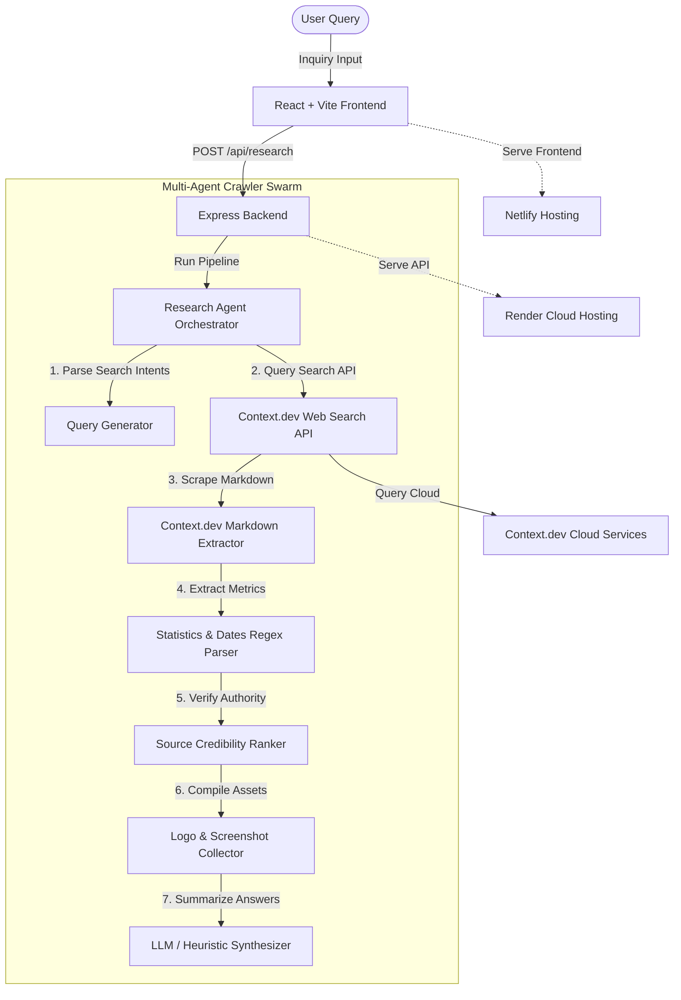

# Context Research Studio

Context Research Studio is an AI-powered full-stack research dashboard app. It coordinates a multi-agent system to search and scrape clean markdown from web URLs using the Context.dev API, extracting structured statistics, timelines, and visual screenshots to return a citation-backed research dossier.

---

## Technical Architecture & Flow



1. **Vite + React Frontend**: High-fidelity dark glassmorphic dashboard styled with Tailwind CSS, animating progress stages with Framer Motion, and graphing statistics with Recharts.
2. **Express.js Backend Router**: Accepts query inputs, parses search intent, crawls links, scrapes markdown content via `contextClient.js`, and synthesizes final JSON reports.
3. **Context.dev Integration**: Primary data scraper and screenshot gatherer module config.
4. **Demo Mode fallback**: Allows developer testing out-of-the-box even without active keys.


---

## Workspace Directory Structure

```text
d:\Voice Agent\
├── backend\
│   ├── routes\
│   │   └── research.js         # Endpoint POST /api/research
│   ├── services\
│   │   ├── contextClient.js    # Reusable Context.dev API wrapper
│   │   └── researchAgent.js    # Orchestrator & high-fidelity mockup database
│   ├── utils\
│   │   ├── sourceRanker.js     # Credibility and category domain analyzer
│   │   └── extractStats.js     # Statistical regex content parser
│   ├── .env                    # Configured credentials
│   ├── package.json
│   ├── server.js               # Express entrypoint
│   └── test-agent.js           # Verification test script
└── frontend\
    ├── src\
    │   ├── components\         # Modular UI items
    │   │   ├── AnswerCard.jsx  # Summary + radial confidence gauge
    │   │   ├── EmptyState.jsx  # Standard placeholder layout
    │   │   ├── FollowupQuestions.jsx
    │   │   ├── ImageGallery.jsx# Screenshot visualizer
    │   │   ├── ResearchProgress.jsx # Multi-agent loader status logs
    │   │   ├── SearchHero.jsx  # Search query console
    │   │   ├── SourcePanel.jsx # Credibility rating source cards
    │   │   ├── StatsGrid.jsx   # Stats metrics + Recharts bar distribution
    │   │   └── Timeline.jsx    # Vertical roadmap
    │   ├── App.jsx             # React dashboard coordinator
    │   ├── index.css
    │   └── main.jsx
    ├── index.html
    ├── tailwind.config.js
    ├── postcss.config.js
    ├── vite.config.js
    └── package.json
```

---

## Installation & Setup

Ensure you have [Node.js](https://nodejs.org) installed on your system.

### 1. Setup Backend
Open a command prompt or terminal in the `backend/` directory:
```bash
cd backend
npm install
```

Configure the environment keys inside `backend/.env`:
```env
PORT=5000
CONTEXT_API_KEY=ctxt_secret_f7adc3562fbb481da141e8434dd857c7
AI_API_KEY=
```

### 2. Setup Frontend
Open a separate terminal window in the `frontend/` directory:
```bash
cd frontend
npm install
```

---

## Running the Application

### 1. Run Backend Server
In the `backend/` directory, execute:
```bash
npm run dev
```
The server will start listening on [http://localhost:5000](http://localhost:5000).

### 2. Run React App Dev Server
In the `frontend/` directory, execute:
```bash
npm run dev
```
The frontend will start running on [http://localhost:3000](http://localhost:3000) (with active proxy endpoints forwarding requests to the Express server).

---

## Running Verification Tests

To verify that the agent compilation schemas and data payloads align perfectly:
```bash
cd backend
node test-agent.js
```
The console will execute the agents pipeline in test mode and confirm if all JSON schema properties pass validation successfully.
